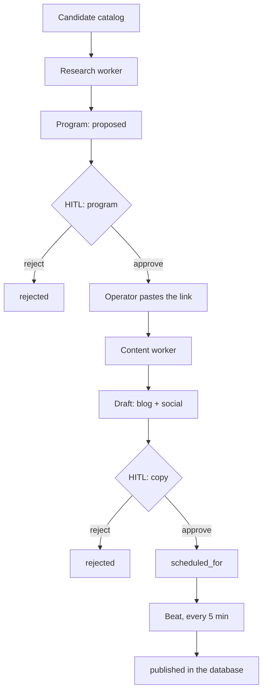
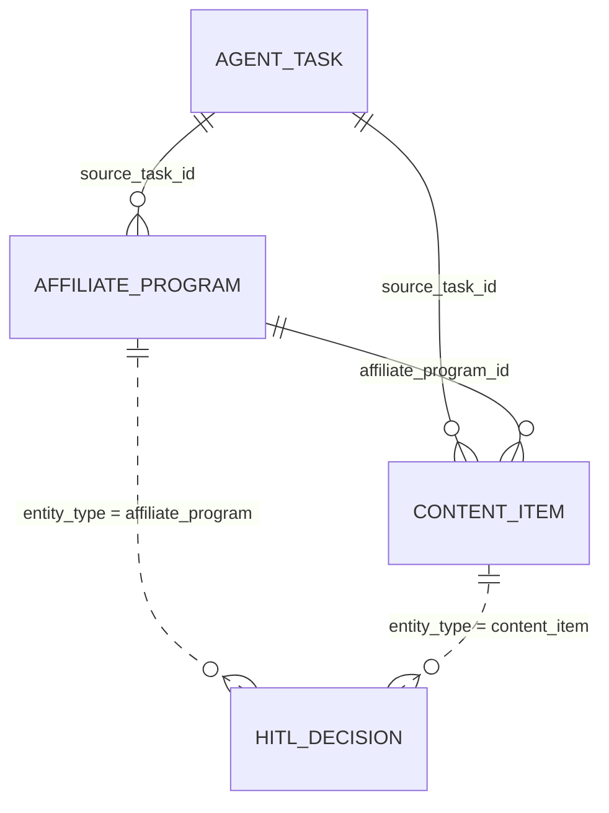
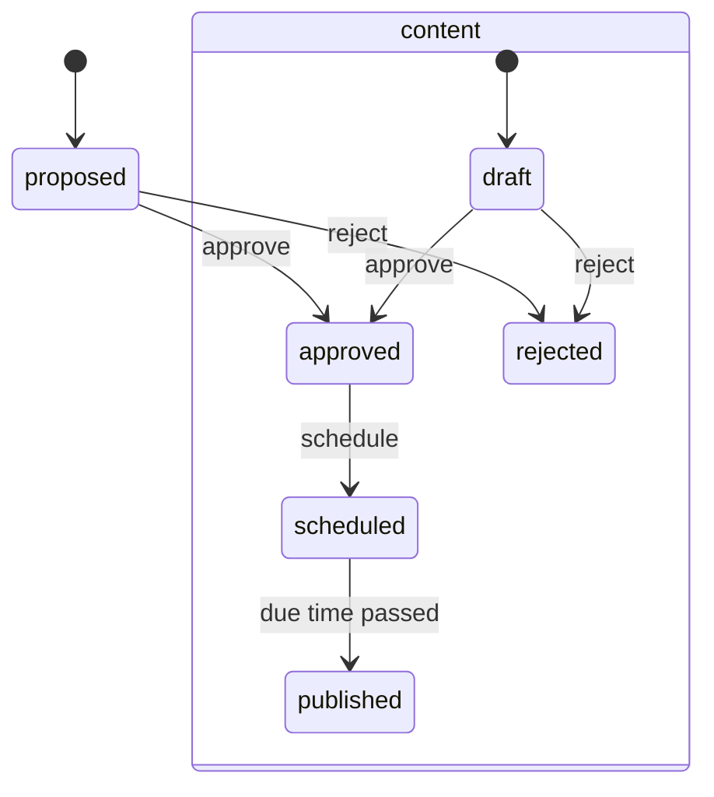
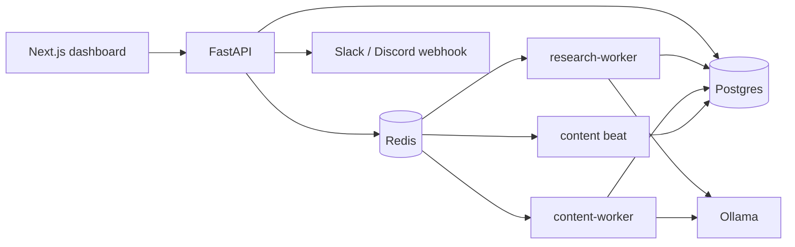
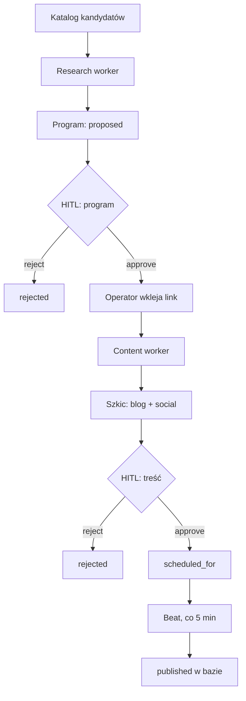
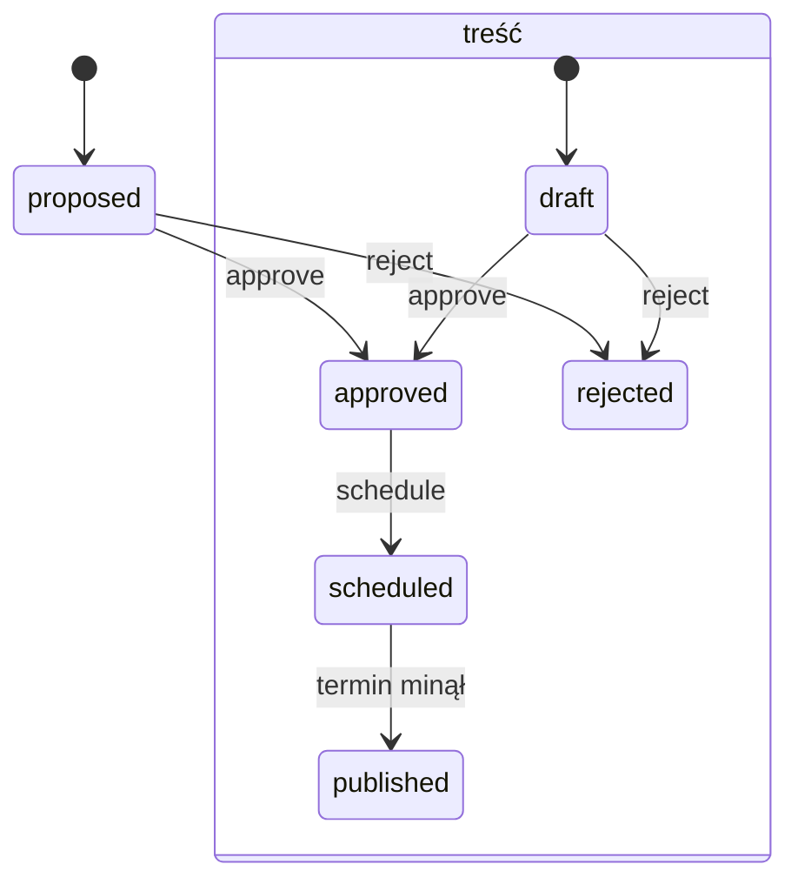

[English](#english) · [Polski](#polski)

<a id="english"></a>

# Autonomous AI Revenue System

A system in which agents propose affiliate programs and copy, and a human releases only what they have approved themselves.

The business goal is repeatable affiliate revenue (high-ticket and SaaS with recurring commission), then further streams on the same skeleton. This repository delivers the first stream: the loop from a program recommendation to a scheduled publication. The operator's target ($40–50k per month from affiliate alone) is a product hypothesis. It is not a result of this code.

## Problem

Doing affiliate marketing by hand splits into four jobs that do not scale together:

1. Choose programs that are worth promoting at all.
2. Write an article and a post for each of them.
3. Insert a real affiliate link and publish on a cadence, not in a burst.
4. Stop before a weak recommendation, or a link that does not exist, goes out into the world.

One person can do this once. They cannot do it every week for a dozen programs and still make sure the agent publishes nothing on its own.

## Context

The problem belongs to the operator of a single content catalog (blog + social) about software for small businesses. It does not belong to an affiliate network, and it does not belong to a brand that already has a content team.

The stakes are specific to that operator:

- **Recurring commission** (SaaS) is worth more than a one-off payout, because the same referred customer pays every month.
- **High-ticket** raises the payout per conversion, so a small amount of traffic can still make sense.
- **A bad publish costs more than no publish.** A weak recommendation burns the reader's trust, and an undisclosed affiliate relationship is a compliance problem under the rules for material connections ([FTC Endorsement Guides](https://www.ftc.gov/business-guidance/resources/ftcs-endorsement-guides-what-people-are-asking)).

That is why the product does not start from "an agent that publishes by itself." It starts from an agent that prepares a decision, and from a human who records it.

## Solution

Stage 1, which is what this repository contains, closes one loop:

1. **Research** takes a catalog of candidates (SaaS / high-ticket), skips programs already stored, and asks the model for a two-sentence rationale for each new one. The row lands as `proposed`.
2. **A human** approves or rejects the program in the dashboard. The decision is stored in `hitl_decisions`, and a webhook (Slack or Discord) receives a short notice.
3. **A human** pastes the real affiliate link. The agent does not invent it.
4. **Content** writes a blog draft and a social draft only for `approved` programs that have a link and do not yet have content.
5. **A human** approves the copy and sets a time. Every five minutes the publish worker marks due items as `published`.

The two gates are intentional. Approving a program means "this product may be promoted." Approving the copy means "this specific text may go out." One approval for both would mix offer selection with copy quality.



## Data model

Four tables are enough to reconstruct what an agent proposed and what a human did with it.

| Table | What it is for |
|---|---|
| `agent_tasks` | Work queue: type, status, input, output, error, timestamps. |
| `affiliate_programs` | Program, rationale, status, link. Commercial signals (`commission`, `recurring`) live in `extras`. |
| `content_items` | Text, channel (`blog` / `social`), status, schedule, link to the program. |
| `hitl_decisions` | Judgment log: entity, decision, actor, comment, time. |

`hitl_decisions` has no foreign key to a single table. `entity_type` + `entity_id` describe both a program and a piece of content. The second gate does not need a second decision table.



Statuses are a state machine, not a loose label:



A program in any state other than `proposed` cannot be approved again (the API returns 409). The same rule applies to content outside `draft`. History stays in the log, and the current state is singular.

## Architecture

The API accepts a command, stores a task, and sends it to a named queue. The backend does not import an agent worker. Research and content have their own images, their own queues, and a shared database.



The shared contract lives in the `revenue_swarm` package (`shared/`): models, enums, the model client, task names, and the `queued → running → succeeded / failed` lifecycle. Alembic stays with the backend — one owner of the schema.

| Directory | Role |
|---|---|
| `shared/` | Contract used by more than one process. |
| `backend/` | HTTP, HITL decisions, webhook, migrations. |
| `agents/research/` | Program discovery. |
| `agents/content/` | Drafts and marking publication. |
| `frontend/` | Dashboard: proposals, links, content, starting the agents. |

A new stream (ebook, store) is meant to be a new agent directory and a new Compose service, attached to the same queue and the same state tables. The API should not know its implementation.

## Decisions

| Choice | Reason |
|---|---|
| Two HITL gates | The offer and the text are different risks. One acceptance hides which of the two a human actually checked. |
| A human pastes the affiliate link | A tracking link is a commercial credential. An agent that guesses it publishes a dead URL or someone else's. |
| A candidate catalog in v1, not scraping | There is no time series of EPC, cookie window, or approval rate yet. A made-up ranking from the internet would look like analysis and would be a list. The catalog is explicitly sample data (`example-*.test`), and the model's rationale is an opinion for review, not a score. |
| `extras` (JSONB) for commission and `recurring` | These are signals, not metrics yet. A scoring schema will exist when real numbers exist. Until then there is no point adding columns for data I do not have. |
| Celery and named queues; LangChain only as the Ollama client | An orchestrator that is "one graph calling the agents" would couple model latency to the API process. Here the API returns 202, and the worker lives separately. LangChain (`ChatOllama`) sits in the text-generation layer. |
| Agents write to Postgres directly | One operator, one language, one schema. An internal API between an agent and the database would add service-to-service auth without a new capability. The boundary is held elsewhere: the backend does not import agent code, it calls `send_task` by name. |
| Publication = a status change in the database | The rule to prove first is that nothing reaches `published` without `approved` and a due time. Wiring a blog or social API at this stage would test someone else's service, not the product rule. |
| `LLM_STUB=1` by default | Tests and a local run do not depend on a downloaded model. A real Ollama call is a switch, not a condition for the loop to come up. |
| Webhook after the decision, not before | The channel (Slack/Discord) reports that state changed. It is not a second, inconsistent source of truth next to the database. |

## Four roles in this repository

**Business analyst.** The problem is narrowed to one operator and one stream. The requirement "the agent publishes by itself" was rewritten as "the agent prepares, the human releases." The criterion for a program's value is qualitative and explicit: recurring SaaS commission, or a high payout per sale. The metric that does not exist yet (EPC = commission / clicks) is not pretended.

**Architect.** Boundaries sit at processes, not at folders inside one application. The API, research, content, and beat scale and restart separately. Business state is in Postgres, transport is in Redis, text is in Ollama. The dashboard talks only to the API.

**Data analyst.** The grain of analysis is already in the schema, before any warehouse exists:

- `agent_tasks` — how many jobs succeeded, with what input and what error,
- `hitl_decisions` — how often a human rejects the model's proposal, and with what comment,
- content status — where work in progress sits (`draft` vs `scheduled` vs `published`).

This is a decision log, not a revenue dashboard. There is no revenue until publication leaves for a real channel and an affiliate network returns clicks and commission. `extras` is the place for those numbers when they appear, without a migration "just in case."

**Product owner.** Stage 1 is finished as a control loop, not as an affiliate business. Ebooks, payments, and a store are the next streams on the same HITL and the same queue — not parallel projects inside the same code. The dashboard refreshes every 5 seconds and shows the latest task, the program queues, and the content, because the operator should see state rather than read worker logs.

## Tools

| Layer | What it is for |
|---|---|
| Python 3.12, uv workspace | One environment for `shared`, the API, and the agents, with separate image dependencies. |
| FastAPI | Dashboard contract: recommendations, content, starting research, tasks. |
| PostgreSQL 18, SQLAlchemy, Alembic | State and schema migrations. |
| Redis, Celery | `research` and `content` queues, beat every 5 minutes. |
| Ollama, LangChain `ChatOllama` | Program rationale (temperature 0.2) and copy (0.5). Stub when `LLM_STUB=1`. |
| Next.js, Tailwind, shadcn/ui | HITL panel. |
| Docker Compose | Postgres, Redis, Ollama, API, worker, research, content, beat, frontend. |
| pytest, Ruff | Unit and integration tests (integration tests need Postgres) and one lint for the whole repo. |

Automation sits in the schedule and the queues. The model sits in two places: the rationale for why a program made the list at all, and the draft copy. Analytics is, for now, the shape of the data (tasks, decisions, statuses), not a revenue report.

## Sources behind the thesis

- [FTC, Endorsement Guides](https://www.ftc.gov/business-guidance/resources/ftcs-endorsement-guides-what-people-are-asking) — a material connection (an affiliate link) has to be clear to the reader. That is why copy does not go out without a human, and why the link is appended explicitly, on its own line under the text.
- EPC (earnings per click = commission / clicks) is a standard program metric on affiliate networks, not an invention of this repo. v1 does not have that number in the data, so the code does not rank by it. Definition and formula: [Affiliyo, EPC](https://affiliyo.com/glossary/epc).
- The $40–50k per month target is an assumption of this product's operator. It does not come from a market study stored in the repository.

## Result

The whole stage-1 loop can be walked without hand-editing the database:

1. `POST /research/run` queues discovery. The worker inserts new programs as `proposed`, or skips names that already exist.
2. The dashboard (or `POST /recommendations/{id}/approve|reject`) closes the program gate. A rejected program does not return to content.
3. A `PATCH` of the affiliate link unlocks generation.
4. Content creates two drafts (`blog`, `social`) and does not pick a program that already has content.
5. After approve and schedule, beat (or `POST /content/publish-due`) sets `published` and `published_at` once `scheduled_for` has passed.

What this result is not: blog traffic, commission, an affiliate-network integration, publication to a real CMS or social API, ebooks, Stripe, Shopify. Those are later stages of the same product. They are not in this repository, and the `example-*.test` catalog is there to keep that visible.

## Run

```bash
cp .env.example .env
docker compose up --build
```

Dashboard: [http://localhost:3000](http://localhost:3000). API: [http://localhost:8000/health](http://localhost:8000/health).

With `LLM_STUB=1` the agents store a fixed string instead of calling a model. To generate through Ollama, set `LLM_STUB=0` and pull the model in `OLLAMA_MODEL` (default `llama3.2:1b`). `WEBHOOK_URL` is optional — an empty value turns the notification off. `WEBHOOK_KIND` is `slack` or `discord`.

Tests and lint from the repository root:

```bash
uv sync --all-packages

uv run --directory backend --package revenue-swarm-backend pytest
uv run --directory agents/research --package research-agent pytest
uv run --directory agents/content --package content-agent pytest

uv run ruff check .
uv run ruff format .
```

`scripts/test.sh` runs those three pytest invocations. `--directory` is required: from the repo root, pytest treats the root `pyproject.toml` as rootdir and rejects `pytest_plugins` in each package. Integration tests need Postgres (`docker compose up -d postgres`).

---

[English](#english) · [Polski](#polski)

<a id="polski"></a>

# Autonomous AI Revenue System

System, w którym agenci proponują programy afiliacyjne i treści, a człowiek puszcza dalej tylko to, co sam zatwierdzi.

Cel biznesowy to powtarzalny przychód z afiliacji (high-ticket i SaaS z prowizją cykliczną), a potem kolejne strumienie na tym samym szkielecie. To repozytorium dowozi pierwszy strumień: pętlę od rekomendacji programu do zaplanowanej publikacji. Kwota docelowa operatora ($40–50k miesięcznie z samej afiliacji) jest hipotezą produktu. Nie jest wynikiem tego kodu.

## Problem

Affiliate marketing „ręcznie” rozpada się na cztery prace, które nie skalują się razem:

1. Wybrać programy, które w ogóle warto promować.
2. Napisać pod nie artykuł i post.
3. Wstawić prawdziwy link afiliacyjny i opublikować w rytmie, a nie hurtem.
4. Zatrzymać się, zanim w świat wyjdzie słaba rekomendacja albo link, którego nie ma.

Jedna osoba da radę zrobić to raz. Nie da rady robić tego co tydzień dla kilkunastu programów i jeszcze pilnować, żeby agent niczego nie opublikował sam.

## Kontekst

Problem dotyczy operatora jednego katalogu treści (blog + social) o oprogramowaniu dla małego biznesu, nie sieci afiliacyjnej i nie marki, która ma dział contentu.

Znaczenie jest jednostkowe, nie „rynkowe”:

- **Prowizja cykliczna** (SaaS) jest warta więcej niż jednorazowa wypłata, bo ten sam polecony klient płaci co miesiąc.
- **High-ticket** podnosi wypłatę za jedną konwersję, więc mało ruchu może mieć sens.
- **Błąd publikacji jest droższy niż brak publikacji.** Zła rekomendacja psuje zaufanie czytelnika, a nieoznaczona współpraca afiliacyjna jest problemem zgodności z zasadami ujawniania powiązań materialnych ([FTC Endorsement Guides](https://www.ftc.gov/business-guidance/resources/ftcs-endorsement-guides-what-people-are-asking)).

Dlatego produkt nie zaczyna się od „agenta, który sam publikuje”. Zaczyna się od agenta, który przygotowuje decyzję, i od człowieka, który ją zapisuje.

## Rozwiązanie

Etap 1, który jest w tym repozytorium, zamyka jedną pętlę:

1. **Research** bierze katalog kandydatów (SaaS / high-ticket), pomija programy już zapisane w bazie i dla nowych prosi model o dwuzdaniowe uzasadnienie. Wiersz ląduje jako `proposed`.
2. **Człowiek** w dashboardzie zatwierdza albo odrzuca program. Decyzja zostaje w `hitl_decisions`, a webhook (Slack albo Discord) dostaje skrót.
3. **Człowiek** wkleja prawdziwy link afiliacyjny. Agent go nie wymyśla.
4. **Content** pisze szkic bloga i szkic posta tylko dla programów `approved`, które mają link i nie mają jeszcze treści.
5. **Człowiek** zatwierdza treść i ustawia termin. Co pięć minut worker publikacji oznacza zaległe pozycje jako `published`.

Dwie bramki są celowe. Zatwierdzenie programu mówi „ten produkt wolno promować”. Zatwierdzenie treści mówi „ten konkretny tekst wolno puścić”. Jedna zgoda na obie rzeczy mieszałaby wybór oferty z jakością copy.



## Model danych

Cztery tabele wystarczają, żeby odtworzyć, co agent zaproponował i co człowiek z tym zrobił.

| Tabela | Po co jest |
|---|---|
| `agent_tasks` | Kolejka pracy: typ, status, wejście, wyjście, błąd, czasy. |
| `affiliate_programs` | Program, uzasadnienie, status, link. Sygnały handlowe (`commission`, `recurring`) siedzą w `extras`. |
| `content_items` | Tekst, kanał (`blog` / `social`), status, termin, powiązanie z programem. |
| `hitl_decisions` | Dziennik ocen: encja, decyzja, aktor, komentarz, czas. |

`hitl_decisions` nie ma klucza obcego do jednej tabeli. `entity_type` + `entity_id` opisują i program, i treść. Dzięki temu druga bramka nie wymaga drugiej tabeli decyzji.


Statusy są maszyną, nie luźną etykietą:



Program w stanie innym niż `proposed` nie da się zatwierdzić drugi raz (API zwraca 409). To samo dotyczy treści poza `draft`. Historia zostaje w dzienniku, a bieżący stan jest jeden.

## Architektura

API przyjmuje polecenie, zapisuje zadanie i wysyła je na nazwaną kolejkę. Worker agenta nie jest importowany przez backend. Research i content mają własne obrazy, własne kolejki i wspólną bazę.


Wspólny kontrakt żyje w pakiecie `revenue_swarm` (`shared/`): modele, enumy, klient modelu, nazwy zadań, cykl `queued → running → succeeded / failed`. Alembic zostaje przy backendzie — jeden właściciel schematu.

| Katalog | Rola |
|---|---|
| `shared/` | Kontrakt, z którego korzysta więcej niż jeden proces. |
| `backend/` | HTTP, decyzje HITL, webhook, migracje. |
| `agents/research/` | Odkrywanie programów. |
| `agents/content/` | Szkice i oznaczanie publikacji. |
| `frontend/` | Dashboard: propozycje, linki, treści, uruchomienie agentów. |

Nowy strumień (e-book, sklep) ma być nowym katalogiem agenta i nowym serwisem w Compose, podpiętym tą samą kolejką i tymi samymi tabelami stanu. API nie powinno znać jego implementacji.

## Decyzje

| Wybór | Powód |
|---|---|
| Dwie bramki HITL | Oferta i tekst to różne ryzyka. Jedna akceptacja ukrywa, którą z tych rzeczy człowiek naprawdę sprawdził. |
| Link afiliacyjny wpisuje człowiek | Link śledzący jest credentialem handlowym. Agent, który go zgaduje, publikuje martwy albo cudzy URL. |
| Katalog kandydatów w v1, nie scraping | Nie ma jeszcze szeregu czasowego EPC, cookie window ani approval rate. Zmyślony ranking z internetu wyglądałby jak analiza, a byłby listą. Katalog jest jawnie przykładowy (`example-*.test`), a uzasadnienie modelu jest opinią do przeglądu, nie score. |
| `extras` (JSONB) na prowizję i `recurring` | To sygnały, nie jeszcze metryki. Schemat punktacji powstanie, gdy pojawią się prawdziwe liczby. Do tego czasu nie mnożę kolumn pod dane, których nie mam. |
| Celery i kolejki nazwane, LangChain tylko jako klient Ollama | Orkiestrator „jeden graf, który woła agentów” sprzęgałby czas odpowiedzi modelu z procesem API. Tu API zwraca 202, a worker żyje osobno. LangChain (`ChatOllama`) jest w warstwie generowania tekstu. |
| Agenci piszą do Postgres wprost | Jeden operator, jeden język, jeden schemat. Osobne API wewnętrzne między agentem a bazą dodałoby autoryzację serwis–serwis bez nowej zdolności. Granicę trzyma co innego: backend nie importuje kodu agenta, tylko `send_task` po nazwie. |
| Publikacja = zmiana statusu w bazie | Najpierw ma być pewne, że bez `approved` i bez terminu nic nie przechodzi do `published`. Podpięcie bloga i social API na tym etapie testowałoby cudzy serwis, nie regułę produktu. |
| `LLM_STUB=1` domyślnie | Testy i lokalny bieg nie zależą od ściągniętego modelu. Prawdziwe wywołanie Ollama jest przełącznikiem, nie warunkiem, żeby pętla wstała. |
| Webhook po decyzji, nie przed | Kanał (Slack/Discord) informuje, że stan się zmienił. Nie jest drugim, niespójnym źródłem prawdy obok bazy. |

## Cztery role w tym repozytorium

**Analityk biznesowy.** Problem jest zawężony do jednego operatora i jednego strumienia. Wymaganie „agent publikuje sam” zostało przepisane na wymaganie „agent przygotowuje, człowiek puszcza”. Kryterium wartości programu jest jakościowe i jawne: cykliczna prowizja SaaS albo wysoka wypłata za sprzedaż. Metryka, której jeszcze nie ma (EPC = prowizja / kliknięcia), nie została udawana.

**Architekt.** Granice są przy procesach, nie przy folderach w jednej aplikacji. API, research, content i beat skalują się i restartują osobno. Stan biznesowy jest w Postgres, transport w Redis, tekst w Ollama. Dashboard rozmawia tylko z API.

**Analityk danych.** Ziarno analizy jest już w schemacie, zanim pojawi się hurtownia:

- `agent_tasks` — ile prac się udało, z jakim wejściem i błędem,
- `hitl_decisions` — jak często człowiek odrzuca propozycję modelu i z jakim komentarzem,
- status treści — gdzie leży praca w toku (`draft` vs `scheduled` vs `published`).

To jest dziennik decyzji, nie dashboard przychodu. Przychodu nie ma, dopóki publikacja nie wychodzi na prawdziwy kanał i dopóki sieć afiliacyjna nie odda kliknięć oraz prowizji. Pole `extras` jest miejscem na te liczby, gdy się pojawią, bez migracji „na zapas”.

**Product owner.** Etap 1 jest skończony jako pętla kontroli, nie jako biznes afiliacyjny. E-booki, płatności i sklep są następnymi strumieniami na tym samym HITL i tej samej kolejce — nie równoległymi projektami w tym samym kodzie. Dashboard odświeża się co 5 sekund i pokazuje ostatnie zadanie, kolejki programów i treść, bo operator ma widzieć stan, a nie czytać logi workera.

## Narzędzia

| Warstwa | Po co |
|---|---|
| Python 3.12, uv workspace | Jedno środowisko dla `shared`, API i agentów, osobne zależności obrazów. |
| FastAPI | Kontrakt dashboardu: rekomendacje, treści, uruchomienie researchu, zadania. |
| PostgreSQL 18, SQLAlchemy, Alembic | Stan i migracje schematu. |
| Redis, Celery | Kolejki `research` i `content`, beat co 5 minut. |
| Ollama, LangChain `ChatOllama` | Uzasadnienie programu (temperatura 0.2) i copy (0.5). Stub, gdy `LLM_STUB=1`. |
| Next.js, Tailwind, shadcn/ui | Panel HITL. |
| Docker Compose | Postgres, Redis, Ollama, API, worker, research, content, beat, frontend. |
| pytest, Ruff | Testy jednostkowe i integracyjne (integracyjne potrzebują Postgresa) oraz jeden lint na całe repo. |

Automatyzacja jest w harmonogramie i w kolejkach. Model jest w dwóch miejscach: uzasadnienie, czemu program w ogóle trafił na listę, oraz szkic tekstu. Analityka jest na razie w kształcie danych (zadania, decyzje, statusy), nie w raporcie przychodu.

## Źródła, na których stoi teza

- [FTC, Endorsement Guides](https://www.ftc.gov/business-guidance/resources/ftcs-endorsement-guides-what-people-are-asking) — powiązanie materialne (link afiliacyjny) ma być czytelne dla odbiorcy. Stąd treść nie wychodzi bez człowieka i stąd link jest dokładany jawnie, osobną linijką pod tekstem.
- EPC (earnings per click = prowizja / kliknięcia) jest standardową miarą programu w sieciach afiliacyjnych, nie wymysłem tego repo. W v1 tej liczby nie ma w danych, więc kod jej nie rankinguje. Definicja i wzór: [Affiliyo, EPC](https://affiliyo.com/glossary/epc).
- Cel $40–50k miesięcznie jest założeniem operatora tego produktu. Nie pochodzi z badania rynkowego zapisanego w repozytorium.

## Rezultat

Da się przejść całą pętlę etapu 1 bez ręcznego grzebania w bazie:

1. `POST /research/run` kolejkuje odkrywanie. Worker dopisuje nowe programy jako `proposed` albo pomija nazwy, które już są.
2. Dashboard (albo `POST /recommendations/{id}/approve|reject`) zamyka bramkę programu. Odrzucony program nie wraca do contentu.
3. `PATCH` linku afiliacyjnego odblokowuje generowanie.
4. Content tworzy dwa szkice (`blog`, `social`) i nie bierze programu, który treść już ma.
5. Po approve i schedule beat (albo `POST /content/publish-due`) ustawia `published` i `published_at`, gdy `scheduled_for` minął.

Czego ten wynik nie jest: ruchu na blogu, prowizji, integracji z siecią afiliacyjną, publikacji na prawdziwym CMS albo social API, e-booków, Stripe, Shopify. Te rzeczy są kolejnymi etapami tego samego produktu. W tym repozytorium ich nie ma, i katalog `example-*.test` ma o tym przypominać.

## Uruchomienie

```bash
cp .env.example .env
docker compose up --build
```

Dashboard: [http://localhost:3000](http://localhost:3000). API: [http://localhost:8000/health](http://localhost:8000/health).

Przy `LLM_STUB=1` agenci zapisują stały tekst zamiast wołać model. Żeby generować przez Ollamę, ustaw `LLM_STUB=0` i pobierz model z `OLLAMA_MODEL` (domyślnie `llama3.2:1b`). `WEBHOOK_URL` jest opcjonalny — pusta wartość wyłącza powiadomienie. `WEBHOOK_KIND` to `slack` albo `discord`.

Testy i lint z katalogu repozytorium:

```bash
uv sync --all-packages

uv run --directory backend --package revenue-swarm-backend pytest
uv run --directory agents/research --package research-agent pytest
uv run --directory agents/content --package content-agent pytest

uv run ruff check .
uv run ruff format .
```

`scripts/test.sh` odpala te trzy wywołania pytest. `--directory` jest potrzebne: z katalogu głównego pytest bierze korzeniowy `pyproject.toml` jako rootdir i odrzuca `pytest_plugins` w pakietach. Testy integracyjne potrzebują Postgresa (`docker compose up -d postgres`).
